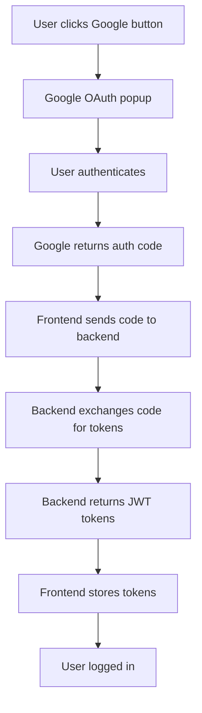

# Google OAuth Integration Summary

This document summarizes the Google OAuth2 integration that has been added to your React TypeScript email client.

## 🎯 What Was Implemented

### 1. **Google OAuth Button Component**

- **File**: `src/components/auth/GoogleLoginButton.tsx`
- **Features**:
  - Uses `@react-oauth/google` with auth-code flow
  - Requests Gmail readonly permissions
  - Integrates with Redux for state management
  - Shows loading states and handles errors

### 2. **Updated Authentication Flow**

- **Auth Types**: Added `GoogleAuthRequest` interface
- **Auth Service**: Updated to handle auth code exchange
- **Redux Store**: Modified to support Google login action
- **API Config**: Configured for your Spring Boot backend

### 3. **Environment Configuration**

- **Provider Setup**: Added `GoogleOAuthProvider` to main.tsx
- **Environment Variables**: Updated .env.example with Google config
- **Setup Script**: Added helper script for easy setup

## 🔧 Key Files Modified

```
src/
├── components/auth/
│   ├── GoogleLoginButton.tsx      # ✨ NEW - Google login button
│   └── index.ts                   # Updated exports
├── pages/
│   └── LoginPage.tsx              # Updated to use new button
├── services/
│   └── authService.ts             # Updated for auth code flow
├── store/slices/
│   └── authSlice.ts              # Updated Redux actions
├── types/
│   └── auth.ts                   # Added GoogleAuthRequest type
├── config/
│   └── apiConfig.ts              # Updated for Spring Boot backend
├── main.tsx                      # Added GoogleOAuthProvider
└── .env.example                  # Updated with Google config
```

## 🚀 How to Use

### 1. **Quick Setup**

```bash
npm run setup:oauth
```

### 2. **Configure Google OAuth**

1. Get Client ID from [Google Cloud Console](https://console.cloud.google.com/)
2. Update `.env` file:
   ```env
   VITE_GOOGLE_CLIENT_ID=your-client-id.apps.googleusercontent.com
   ```

### 3. **Start Development**

```bash
npm run dev
```

## 🔄 Authentication Flow



## 🎨 UI Integration

The Google login button is integrated into your existing Material-UI design:

- **Consistent styling** with your current theme
- **Loading states** that match your UI patterns
- **Error handling** through your existing alert system
- **Responsive design** that works on all screen sizes

## 🔒 Security Features

- **Auth Code Flow**: Most secure OAuth2 flow for web apps
- **Backend Token Exchange**: Sensitive operations happen on server
- **Scope Limitation**: Only requests necessary Gmail permissions
- **Token Storage**: Uses localStorage with proper cleanup

## 📡 Backend Integration

Your Spring Boot backend receives requests like:

```http
POST /api/auth/google
Content-Type: application/json

{
  "authCode": "4/0AX4XfWh-xxxxxx"
}
```

Expected response:

```json
{
  "accessToken": "your-jwt-token",
  "refreshToken": "your-refresh-token",
  "user": {
    "id": "user-id",
    "email": "user@gmail.com",
    "name": "User Name"
  }
}
```

## 🐛 Debugging

Enable debug mode in `.env`:

```env
VITE_LOG_LEVEL=debug
```

This shows:

- API request/response logs
- OAuth flow progress
- Token storage events

## 📚 Documentation

- **Setup Guide**: `docs/GOOGLE_OAUTH_SETUP.md`
- **Google OAuth Docs**: https://developers.google.com/identity/oauth2/web/guides/overview
- **React OAuth Library**: https://github.com/MomenSherif/react-oauth

## ✅ Next Steps

1. **Get Google Client ID** from Google Cloud Console
2. **Update .env file** with your actual Client ID
3. **Test the integration** with your backend
4. **Customize scopes** if you need different permissions
5. **Add error handling** for production edge cases

The integration is now complete and ready for testing! 🎉
